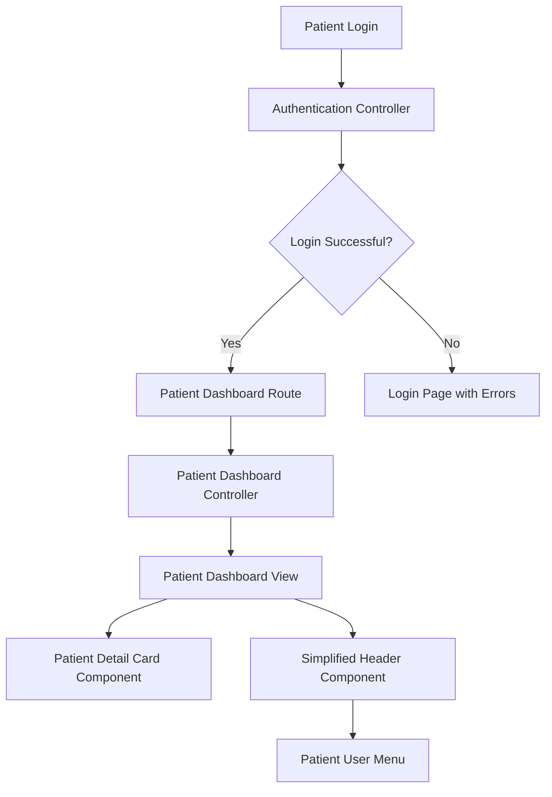
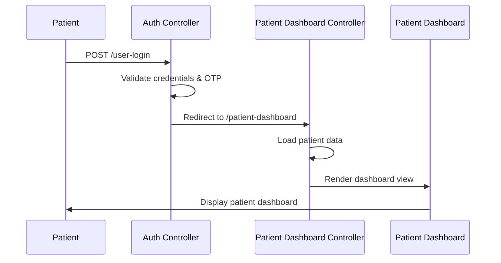

# Design Document

## Overview

The Patient Dashboard Flow feature creates a dedicated, simplified dashboard interface for authenticated patients in the clinic management system. This design leverages the existing patient_detail_enhanced.blade.php component as the foundation while creating a new frontend-focused layout with minimal navigation and patient-specific functionality.

## Architecture

### High-Level Architecture



### Route Flow



## Components and Interfaces

### 1. Authentication Flow Modification

**File**: `app/Http/Controllers/Auth/AuthenticatedSessionController.php`
- Modify the `store()` method to detect patient users and redirect to patient dashboard
- Add role-based redirection logic

**File**: `Modules/Frontend/Http/Controllers/Auth/UserController.php`
- Update `loginstore()` method to redirect patients to dashboard instead of home

### 2. Patient Dashboard Controller

**New File**: `Modules/Frontend/Http/Controllers/PatientDashboardController.php`
- Handle patient dashboard route
- Load patient-specific data (appointments, prescriptions, triage records)
- Provide API endpoints for dashboard components

### 3. Patient Dashboard View

**New File**: `Modules/Frontend/Resources/views/patient_dashboard.blade.php`
- Simplified layout without sidebar
- Reuse patient detail card from existing enhanced view
- Custom header with minimal navigation

### 4. Simplified Header Component

**New File**: `Modules/Frontend/Resources/views/components/patient_header.blade.php`
- Home link (to patient dashboard)
- Search functionality
- User icon with dropdown menu
- No administrative links or complex navigation

### 5. Patient Layout

**New File**: `Modules/Frontend/Resources/views/layouts/patient_layout.blade.php`
- Clean, minimal layout for patient interface
- Include necessary CSS/JS for patient functionality
- Responsive design for mobile and desktop

## Data Models

### Patient Dashboard Data Structure

```php
[
    'patientInfo' => [
        'id' => int,
        'name' => string,
        'email' => string,
        'contact' => string,
        'dob' => date,
        'profile_image' => string
    ],
    'recentTriageRecords' => Collection,
    'recentPrescriptions' => Collection,
    'upcomingAppointments' => Collection,
    'dashboardStats' => [
        'total_appointments' => int,
        'upcoming_appointments' => int,
        'total_prescriptions' => int,
        'last_visit' => date
    ]
]
```

### User Menu Options

Based on the current frontend header structure, the patient dashboard will include these menu options in the user dropdown:

```php
[
    'book_appointment' => [
        'label' => 'Book Appointment',
        'route' => 'services',
        'icon' => 'ph-calendar-plus',
        'description' => 'Schedule new appointment'
    ],
    'wallet_history' => [
        'label' => 'Wallet Balance',
        'route' => 'wallet-history',
        'icon' => 'ph-wallet',
        'show_balance' => true
    ],
    'manage_profile' => [
        'label' => 'Other Patient',
        'route' => 'manage-profile',
        'icon' => 'ph-users-three',
        'description' => 'Newly added members'
    ],
    'appointment_list' => [
        'label' => 'My Appointments',
        'route' => 'appointment-list',
        'icon' => 'ph-calendar-check',
        'description' => 'All appointments'
    ],
    'encounter_list' => [
        'label' => 'Triage',
        'route' => 'encounter-list',
        'icon' => 'ph-speedometer',
        'description' => 'Close active triage'
    ],
    'account_setting' => [
        'label' => 'Setting',
        'route' => 'account-setting',
        'icon' => 'ph-lock',
        'description' => 'Change password'
    ],
    'logout' => [
        'label' => 'Logout',
        'route' => 'user-logout',
        'icon' => 'ph-sign-out',
        'modal' => true
    ]
]
```

## Error Handling

### Authentication Errors
- Invalid credentials: Redirect to login with error message
- Session expired: Redirect to login with session timeout message
- Unauthorized access: Redirect to login with access denied message

### Dashboard Loading Errors
- Patient data not found: Display error message with support contact
- API endpoint failures: Show user-friendly error messages
- Network connectivity issues: Provide retry mechanisms

### Graceful Degradation
- If patient detail card fails to load, show basic patient info
- If dashboard stats fail, hide stats section
- Maintain core navigation functionality even if some features fail

## Testing Strategy

### Unit Tests
- Authentication redirection logic
- Patient dashboard controller methods
- Data loading and formatting functions
- User menu generation

### Integration Tests
- Complete login-to-dashboard flow
- Patient data retrieval from database
- Dashboard component rendering
- User menu functionality

### Frontend Tests
- Responsive design across devices
- Header navigation functionality
- Patient detail card display
- Search functionality

### User Acceptance Tests
- Patient login and dashboard access
- Navigation between dashboard sections
- User menu interactions
- Mobile device compatibility

## Security Considerations

### Authentication & Authorization
- Ensure only authenticated patients can access dashboard
- Validate patient identity for all dashboard data requests
- Implement session management and timeout handling

### Data Privacy
- Display only patient's own data
- Secure API endpoints with proper authentication
- Implement audit logging for patient data access

### Input Validation
- Sanitize all user inputs in search functionality
- Validate patient ID parameters in routes
- Implement CSRF protection for all forms

## Performance Considerations

### Data Loading
- Implement lazy loading for dashboard components
- Cache frequently accessed patient data
- Optimize database queries for dashboard statistics

### Frontend Performance
- Minimize CSS/JS bundle size for patient interface
- Implement progressive loading for large data sets
- Use efficient rendering for patient detail components

## Implementation Notes

### Existing Code Reuse
- Leverage existing patient_detail_enhanced.blade.php structure
- Reuse existing patient data loading logic from CustomersController
- Maintain compatibility with existing authentication system

### Route Structure
```php
// New patient-specific routes
Route::get('/patient-dashboard', [PatientDashboardController::class, 'index'])->name('patient.dashboard');
Route::get('/patient/appointments', [PatientDashboardController::class, 'appointments'])->name('patient.appointments');
Route::get('/patient/prescriptions', [PatientDashboardController::class, 'prescriptions'])->name('patient.prescriptions');
```

### CSS/JS Dependencies
- Reuse existing Bootstrap and custom CSS
- Include necessary JavaScript for interactive components
- Maintain consistent styling with clinic management system

### Mobile Responsiveness
- Ensure dashboard works well on mobile devices
- Optimize touch interactions for mobile users
- Implement responsive navigation for small screens